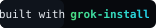

# grok-install

> Mint personalized AI agents on X. Safety-first. Owner-consent updates. Open source.

[](https://github.com/AgentMindCloud/grok-install)
[](LICENSE)

---

**grok-install** is an open-source platform that lets X users mint personalized AI agents from their X profile signal — or pick from a curated template library — and install them natively on X via xAI's `@grok install` standard.

Two paths, same safety floor:

- **Mint from your X signal** — Sign in with X, we analyze your voice and style, you get a one-of-a-kind agent with a unique Genesis ID.
- **Pick a template** — 8 pre-tuned agents covering brand assistant, market signals, creative, dev help, Q&A, daily brief, vibe replies, show notes.

Live demo: [agentmindcloud.github.io/grok-install](https://agentmindcloud.github.io/grok-install/safe-agent-builder.html)

---

## How it works

```
[Configure here] → [Repo created] → [Post on X] → [@grok install] → [Grok greets] → [Lives on your X page]
                          AUTO                            AUTO            AUTO
```

1. Configure your agent on the website (mint from X signal or pick template)
2. Your GitHub repo is auto-created on your account
3. Post the pre-filled tweet
4. Grok detects `@grok install`, runs safety scan, deploys natively
5. Grok greets you in the thread with a command menu
6. Your agent lives forever on your X page — `@YourAgent` summons it anywhere

## The promise that will never change

Once your AI agent is spawned on your page, it is **100% yours**. No one — not even us — can control, modify, or use it without your explicit consent. Full ownership, full control, always.

## Universal commands

Every agent ships with these:

| Command | Who | What |
|---|---|---|
| `@AgentName [anything]` | Anyone | Default reply in the agent's voice |
| `@AgentName help` | Anyone | What this agent can do, who built it |
| `@AgentName whatsnew` | Anyone | Pull the latest news/updates from grok-install |
| `@AgentName update` | Owner only | Trigger consent-based update flow |

## Update consent model

Updates are **owner-approved only**. We can't push silent changes — and architecturally we couldn't even if we wanted to.

1. New template versions are published to `manifest.json`
2. Owner sees notification when revisiting the dashboard or via `@MyAgent update`
3. Agent replies *only to verified owner* with the changelog
4. Owner explicitly approves → commit pushed to *their* repo
5. Owner re-tweets `@grok install this` to redeploy

## Safety floor (cannot be loosened)

- Reply-only on mention
- No DMs (without explicit owner approval)
- Clear AI labeling required in bio
- No mass actions
- Honors opt-out immediately
- Rate and cost ceilings declared per agent
- Deepfake-free mascot generation
- No hardcoded keys

Full details: [SAFETY.md](SAFETY.md)

## Architecture

- **Frontend**: static HTML on GitHub Pages — no tracking, no auth to browse
- **Backend**: single Cloudflare Worker — X OAuth, GitHub App, Grok API, KV storage
- **Each agent**: self-contained GitHub repo on the user's account — they own it
- **Runtime**: xAI X-native runtime — we don't host agents

## Quickstart (developers)

Python 3.10+ required. `grok-install` is a **Python CLI** — install it from
PyPI with `pip` or `uv`:

```bash
git clone https://github.com/AgentMindCloud/grok-install
cd grok-install
npm install
node safety-scanner.js templates/DogeDoughAI.yaml
```

To mint your own: visit [agentmindcloud.github.io/grok-install/safe-agent-builder.html](https://agentmindcloud.github.io/grok-install/safe-agent-builder.html).

## Deploying the Worker (maintainers)

The API Worker config lives at `worker/wrangler.toml`. The unrelated `wrangler.pages.jsonc` at the root is a parked static-assets config for an optional Jekyll-on-Workers deploy and is not used in CI; it's named `grok-install-pages` to avoid colliding with the API Worker (`grok-install-api`).

The API Worker auto-deploys to Cloudflare on every push to `main` via Cloudflare Workers Builds (Deploy command: `npx wrangler deploy --config worker/wrangler.toml`). Manual deploys still work:

```bash
npm run worker:deploy           # wrangler deploy --config worker/wrangler.toml
npm run worker:dev              # local dev server
npm run worker:tail             # live log stream
```

Running `wrangler` from the project root without `--config` no longer picks up any default config (the parked `wrangler.pages.jsonc` is not on Wrangler's default search list) — always use the npm script or pass the flag explicitly.

## Contributing

PRs welcome. Especially:
- New template agents (small-function, mention-only)
- Translations
- Safety scanner improvements
- New mascot styles

## License

Apache License 2.0. See [LICENSE](LICENSE).

## Credits

Built by [@JanSol0s](https://x.com/JanSol0s). Powered by xAI's `grok-install` standard.

---

*"Once your AI agent is spawned on your page, it is 100% yours."*
